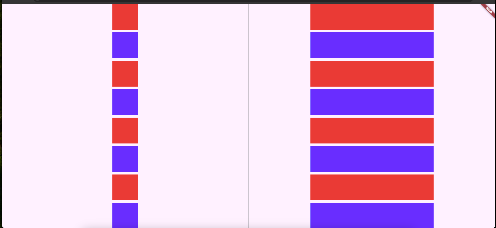
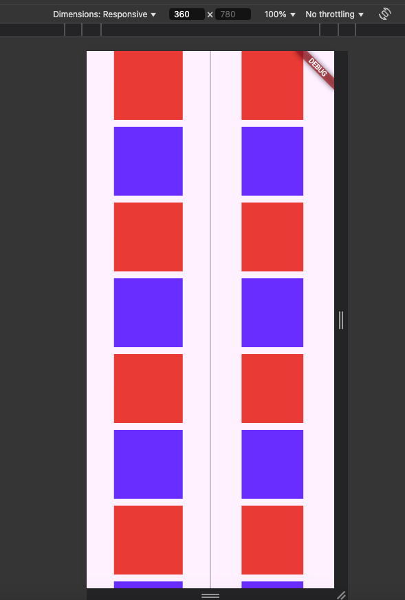

# SliverCenter

A Flutter widget that centers its sliver child within the available space along the cross axis.  This is particularly useful when you want to ensure a sliver, such as a `SliverList` or `SliverGrid`, is positioned in the center of its parent, regardless of the parent's size.

## Usage

Wrap your sliver child with `SliverCenter` to center it.  `SliverCenter` works within the context of a `CustomScrollView` and its sliver layout system.

## Preview

<markdown-accessiblity-table>
<table>
  <tr>
    <th>
        <a href="https://github.com/DemienIlnutskiy/sliver_center/blob/main/example/lib/main.dart">Preview</a>
    </th>
    <th>
        <a href="https://github.com/DemienIlnutskiy/sliver_center/blob/main/example/lib/main.dart">Preview</a>
    </th>
  </th>
  <tr>
    <th>
    <a href="https://github.com/DemienIlnutskiy/sliver_center/blob/main/example/lib/main.dart"></a>
    </th>
    <th>
    <a href="https://github.com/DemienIlnutskiy/sliver_center/blob/main/example/lib/main.dart"></a>
    </th>
  </tr>
</p>

## Code

```dart
SliverCenter(
  sliver: SliverList( // Or any other sliver
    delegate: SliverChildBuilderDelegate(
      (BuildContext context, int index) {
        return Container(
          height: 50,
          color: Colors.blue,
        );
      },
      childCount: 10,
    ),
  ),
)
```
